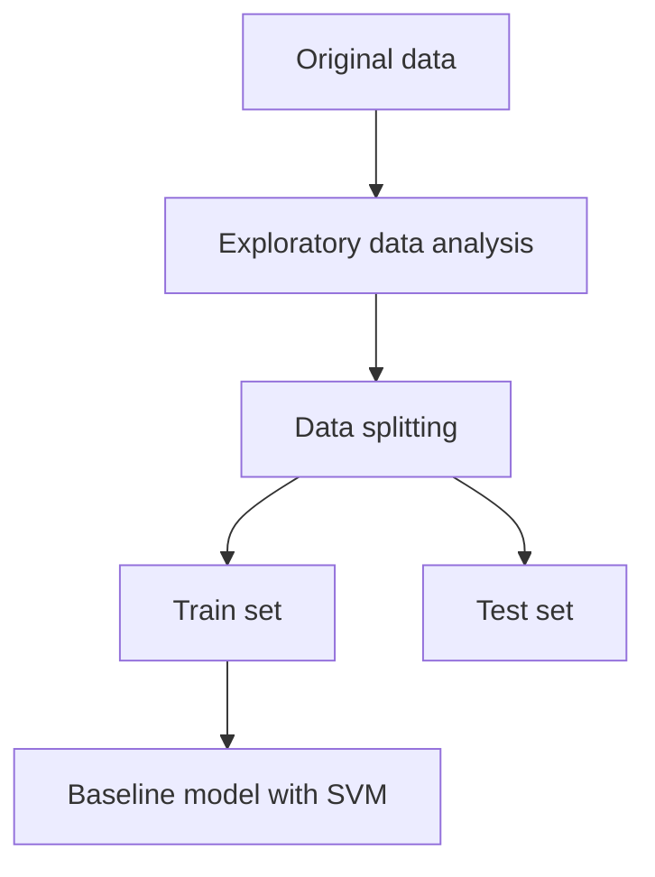

# THE FLOW OF DECISION

```mermaid
    flowchart TD
    0[Original data] --> 1[Exploratory data analysis] --> A
    A[Data splitting] --> B[Train set]
    A --> C[Test set]
    B --> D[Baseline model with SVM]
```

## NOTES

### 👉 Directions:

- `TD` = top → down
- `LR` = left → right
- `BT` = bottom → top

### 🤨 Node shapes:

- `A[box]`
- `A(rounded)`
- `A((circle))`
- `A{diamond}`
