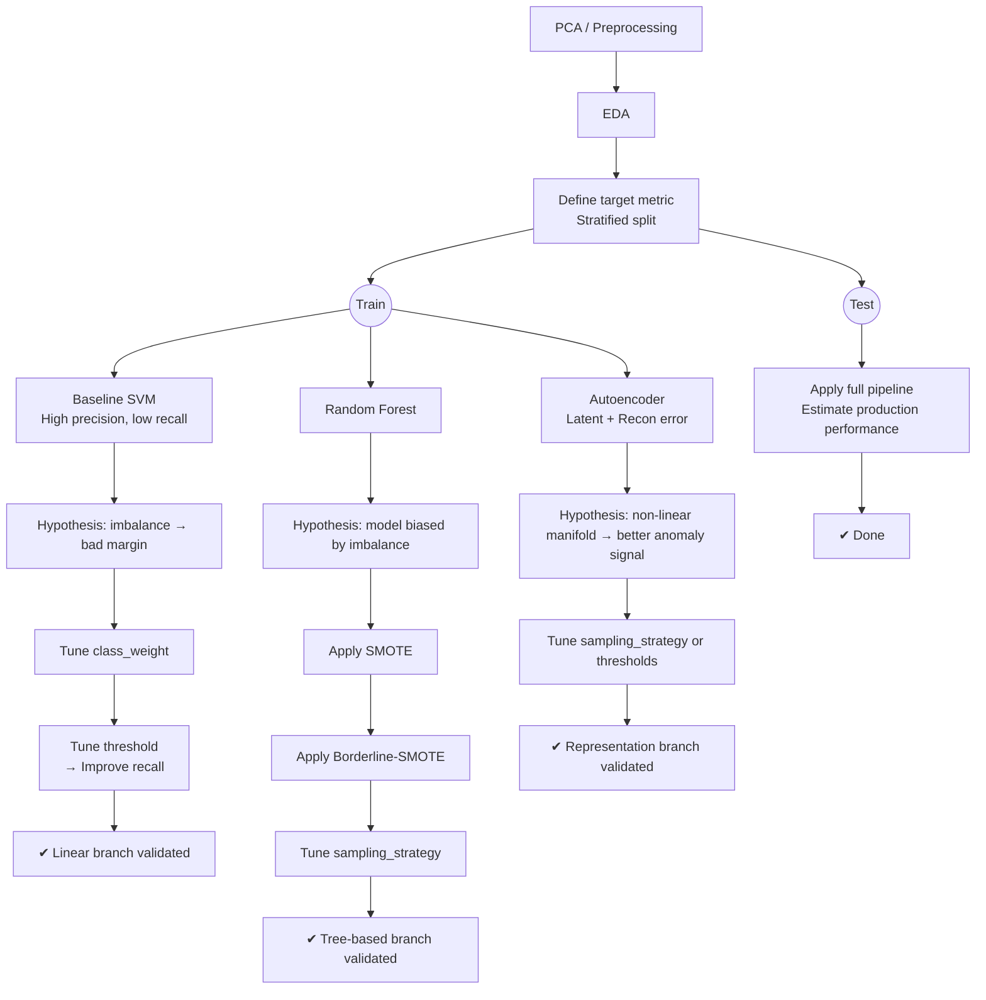

# THE LOGICAL FLOW OF METRIC OPTIMIZATION

# TABLE OF MODEL OPTIMIZATION
| Step | Change | Result |Problem |Explain | Decision |Expect|
|-|-|-|-|-|-|-|
| 1 | Baseline với SVM|...|Precision ở mức cao, trong khi recall chỉ ở mức thấp, mô hình không tốt cho việc bắt các case fraud|Do sự imbalance của dữ liệu, bản chất của SVM optimize với loss giữa 2 lớp bằng nhau, do imbalance, decision boundary sẽ bị kéo sang phái minority, vì mô hình đang hướng giảm loss của majority|Thay đổi **class_weight** để penalize minority classification để dịch decision boundary|Recall có thể sẽ tăng nếu tồn tại các fraud case nằm gần decision boundary nhưng bị miss do imbalance, precision có thể giảm trong trường hợp decision boundary bị đẩy sang majority, gây tăng FP|
|2|Thay đổi hyper-parameter **class_weight**|...| Precision giảm một cách đột ngột, recall tăng ổn | Khi thay đổi giá trị class_weight, decision boundary bị dịch sang hướng majority, tạo ra sự mở rộng bên phía minority, điều này cho phép model bắt được các fraud case, tuy nhiên bởi vì các case bình thường quá nhiều gần margin, FP tăng cực mạnh, dẫn đến precision giảm đau đớn, giá trị balanced làm cho model quyết định phải bắt fraud bằng mọi cách để giảm loss, thậm chí là hy sinh hằng trăm case bình thường. Do đó cho dù có tồn tại những case bị miss, gần boundary, SVM sẽ mở rộng boundary một cách quá trớn để bắt các fraud, mặc dù chúng có thể nằm sau bên trong majority class|Tune class_weight một cách cẩn thận hơn, không nên sử dụng giá trị balanced|Sẽ có trade-off giữa precision và recall, nhưng ta sẽ tìm một **sweet pot** để mô hình có thể tăng được recall, nhưng vẫn giữ được mức precision ổn
| 3 | Tune giá trị **class_weight** trên các khoảng | ... | Precision giảm đều khi weight tăng. Recall tăng nhanh khi weight từ 1-10, sau đó tăng chậm.FP tăng mạnh khi weight quá cao. | Nhóm fraud gần biên dễ được phân tách tuyến tính, nên recall tăng nhanh ở giai đoạn đầu. Nhóm fraud nằm sâu trong majority, cần đẩy ranh giới mạnh → FP tăng. Linear SVM tuyến tính không thể phân tách tốt các cấu trúc phi tuyến. | - Xác định mức weight cân bằng giữa recall và precision. Tiếp tục thử threshold tuning| Cải thiện F2-score.|
| 4 | Tune threshold trên Linear SVM với class_weight=15 | Precision giảm nhẹ, Recall tăng nhẹ, F2-score ~0.810 | Linear SVM tuyến tính gần như đã khai thác tối đa khả năng biểu diễn | Không cải thiện đáng kể F2, chỉ điều chỉnh trade-off Precision/Recall | Dừng điều chỉnh threshold, thử mô hình phi tuyến hoặc thêm anomaly detection | Hy vọng các phương pháp phi tuyến hoặc tín hiệu anomaly sẽ cải thiện F2-score |
| 5 | Sử dụng Random Forest với oversampling (SMOTE) | Cải thiện recall so với Linear SVM mà vẫn giữ precision, xử lý non-linear decision boundary | Linear SVM khó mở rộng hơn, RF có khả năng capture fraud nằm sâu trong majority, oversampling giúp cân bằng dữ liệu |---| Dùng oversampling để tăng khả năng nhận diện fraud mà vẫn duy trì precision; class_weight không trực quan với RF | Hy vọng tăng recall mà không làm giảm quá nhiều precision, khám phá non-linear patterns, chuẩn bị cho các bước nâng cao sau |
| 6 | SMOTE làm precision giảm nhẹ và recall chỉ tăng ít | Dữ liệu gian lận có 2 nhóm: easy fraud (cụm rõ, dễ phát hiện), hard fraud (trùng lặp hoặc outlier, SMOTE tạo nhiễu) | Thay SMOTE bằng Borderline-SMOTE để chỉ sinh mẫu tại vùng biên, củng cố ranh giới yếu, tránh khuếch đại nhiễu | Recall ↗, Precision ít giảm, vẫn khó phát hiện hard fraud |
| 7 | Sử dụng Borderline-SMOTE để resampling lớp minority | Mục tiêu: cải thiện recall mà không làm giảm precision quá nhiều | Nhận xét: Precision cao và ổn định hơn SMOTE (~0.805 vs ~0.707), recall tăng nhẹ; các mẫu tổng hợp tập trung gần biên quyết định, tránh nhiễu sâu vào majority | Giải thích: Borderline-SMOTE tập trung vào các điểm gần biên, giảm False Positives, giữ biên quyết định gần dữ liệu thật | Quyết định: tiếp tục tìm "sweet spot" cho sampling_strategy để tối ưu trade-off recall/precision | Kỳ vọng: Tăng recall hơn nữa mà precision vẫn ổn định, tôn trọng imbalance thực tế |
|8 | Tune sampling_strategy | Thay đổi `sampling_strategy` từ 0.0015 đến 1.0 | F2 tốt nhất trong khoảng 0.0015–0.025; precision giữ ở mức ổn định, recall cải thiện | `sampling_strategy` quá cao có thể làm lệch phân phối dữ liệu thực, giảm precision; quá thấp thì recall không cải thiện | Lựa chọn sampling_strategy phù hợp giúp cân bằng precision và recall; Borderline-SMOTE củng cố biên yếu mà không khuếch đại nhiễu | Chọn sampling_strategy ~0.0015–0.025 cho mô hình cuối | Precision ổn định, recall cải thiện, F2 tối đa, mô hình tránh over-generalize dữ liệu tổng hợp |

# NOTES

## 👉 Directions:

- `TD` = top → down
- `LR` = left → right
- `BT` = bottom → top

## 🤨 Node shapes:

- `A[box]`
- `A(rounded)`
- `A((circle))`
- `A{diamond}`

