# THE LOGICAL FLOW OF METRIC OPTIMIZATION

```mermaid
    graph TD
    0[PCA transformed dataset] --> 1[Exploratory data analysis] --> A
    A[
        Choose target metric
        Data preparation
        Stratified splitting
    ] --> B((Train set))
    A --> C((Test set))
    B --> D[
        Baseline with **SVM**
        High precision + low recall
    ]
    D --> E[Tune class_weight with **balance**]

    E ---> F[Tune **class_weight** for trade-off between recall and precision]

    F --> G[Tune decision boundary **threshold**]

    G --> H[❌]


    B --> L[
        Reserved branch
    ]
```

## NOTES

### 👉 Directions:

- `TD` = top → down
- `LR` = left → right
- `BT` = bottom → top

### 🤨 Node shapes:

- `A[box]`
- `A(rounded)`
- `A((circle))`
- `A{diamond}`

